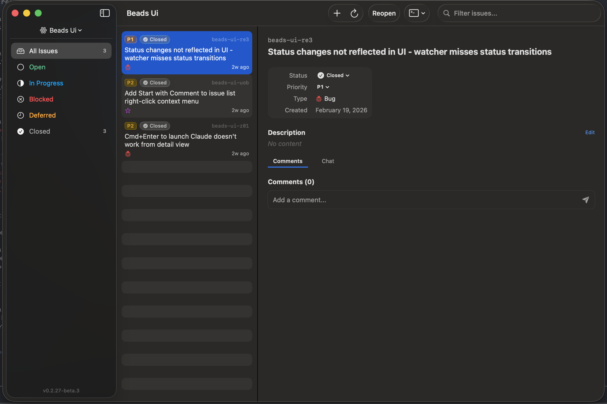

# Beads UI

<p align="center">
  
</p>

A native macOS app for viewing and managing [Beads](https://github.com/baileywickham/beads) issues. Built with SwiftUI.

**[Download latest release](https://github.com/baileywickham/beads-ui/releases/latest)**

### Issue Tracker

Three-panel layout with sidebar filters, issue list, and detail view with inline editing.



## Features

- Browse and filter issues by status, priority, and search
- Edit issue titles, descriptions, design docs, and notes inline
- Create issues and add comments
- Command palette (Cmd+K) for quick issue navigation
- Keyboard-driven navigation (j/k to move between issues)
- Launch Claude Code sessions on issues directly from the app via Ghostty
- Check issue relevance with one click

## Requirements

- macOS 14+
- [bd](https://github.com/baileywickham/beads) CLI installed at `~/.local/bin/bd`
- [Ghostty](https://ghostty.org) (for Claude Code integration)
- [Claude Code](https://claude.ai/claude-code) (for Claude integration)

## Building

```bash
cd Beads
swift build
```

## Running

```bash
cd Beads
swift run
```

## Keyboard Shortcuts

| Shortcut | Action |
|----------|--------|
| j / k | Navigate issues |
| Cmd+N | New issue |
| Cmd+R | Refresh |
| Cmd+K | Command palette |
| Cmd+Shift+C | Launch Claude on selected issue |
| Cmd+1/2/3 | Focus sidebar / list / detail |
